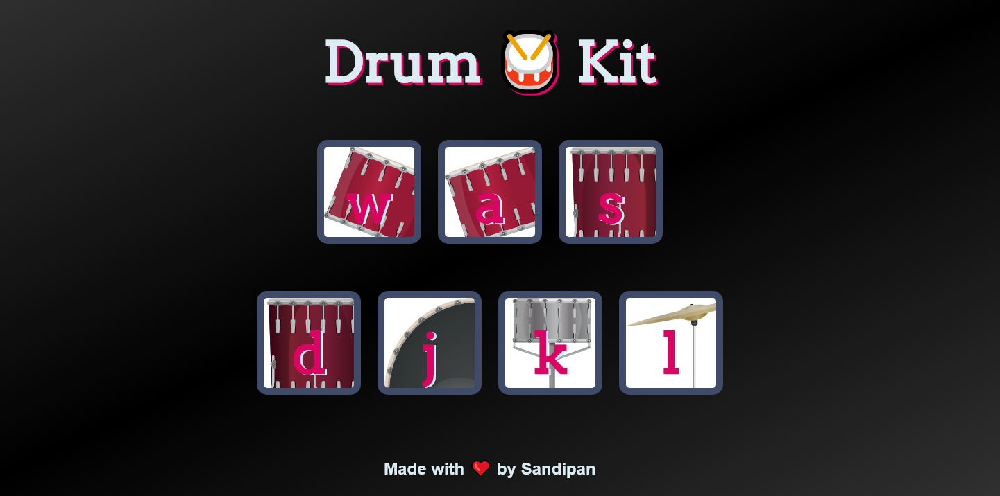

<h2 align="center">Drum-Kit Webpage</h2>

<!-- PROJECT LOGO -->
<p align="center">
   
</p>
<p align="center">
  
  
  
  
  
</p>
<p align="center">
  <a href="https://github.com/sandip2224/Drum-Kit-Webpage"><strong>Explore the docs »</strong></a>
</p>


  <p align="center">
    <br />
    <a href="https://github.com/sandipan_2224/Drum-Kit-Webpage">View Demo</a>
    ·
    <a href="https://github.com/sandipan_2224/Drum-Kit-Webpage/issues">Report Bug</a>
    ·
    <a href="https://github.com/sandipan_2224/Drum-Kit-Webpage/issues">Request Feature</a>
  </p>

<!-- TABLE OF CONTENTS -->
<h2 align="center">Table of Contents</h2>

- [About the Project](#about-the-project)
  - [Preview](#preview)
  - [Built With](#built-with)
- [Getting Started](#getting-started)
  - [Prerequisites](#prerequisites)
  - [Installation](#installation)
- [License](#license)
- [Contributing](#contributing)
- [Contact](#contact)
- [Acknowledgements](#acknowledgements)


<!-- ABOUT THE PROJECT -->

<h2 align="center">About the Project</h2>

This project employs HTML and CSS to build the single-page frontend interface and relies on advanced JavaScript to add the musical notes to the individual buttons that represent the drum-kit accessories. The drum-kit buttons can be easily triggered using mouseclick event or through specific keyboard buttons as visible on the frontend. Give it a go!!

Here's why it's so awesome:
* It brings the accessibility of a drum-kit directly to your fingertips.
* It's really easy to set up after forking and cloning the source code.

**I encourage you to suggest changes by forking this repository and creating a pull request or opening up a new issue.**


<!-- Preview -->
<h2 align="center">Preview</h2>

<p align="center"></p>

<!-- BUILT WITH -->  

<h2 align="center">Built With</h2>

* [HTML](https://www.w3schools.com/html/)
* [CSS](https://www.w3schools.com/css/)
* [JavaScript](https://www.w3schools.com/js/DEFAULT.asp)


<!-- GETTING STARTED -->

<h2 align="center">Getting Started</h2>

To get a local copy up and running follow these simple example steps as mentioned based on your project.  


<!-- PREREQUISITES -->

<h2 align="center">Prerequisites</h2>

This is an example of how to list things you need to set up the project and get it running:  

- [x] HTML 5  
- [x] CSS Designing
- [x] JavaScript EventListeners


<!-- INSTALLATION -->
<h2 align="center">Installation</h2>

To get a local copy up and running follow these simple example steps.

1. Fork and clone this repository using  

```
  git clone https://github.com/sandipan_2224/Drum-Kit-Webpage.git  
  cd Drum-Kit-Webpage 
```  

2. Install firebase CLI inside the folder and login to your CLI account using  

```
  npm install -g firebase-tools  
  firebase login
```

3. Initialize firebase inside the project folder and deploy it to live server using  

```
  firebase init  
  firebase deploy
```  


<!-- LICENSE -->  

<h2 align="center">License</h2>

Distributed under the MIT License. See `LICENSE` for more information.  


<!-- CONTRIBUTING -->

<h2 align="center">Contributing</h2>

Contributions are what make the open source community such an amazing place to be learn, inspire, and create. Any contributions you make are **greatly appreciated**.

1. Fork the Project
2. Create your Feature Branch (`git checkout -b feature/AmazingFeature`)
3. Commit your Changes (`git commit -m 'Add some AmazingFeature'`)
4. Push to the Branch (`git push origin feature/AmazingFeature`)
5. Open a Pull Request  


<!-- CONTACT --> 

<h2 align="center">Contact</h2>

- **Hey guys, I'm Sandipan. Find out more about me** [ here](https://linkedin.com/in/sandipan0164)  
- **Reach out to me at** [ sandipan2224@gmail.com](sandipan2224@gmail.com)  


<!-- ACKNOWLEDGEMENTS -->

<h2 align="center">Acknowledgements</h2>

* [HTML docs](https://www.w3schools.com/html/)
* [CSS docs](https://www.w3schools.com/css/)
* [JavaScript docs](https://www.w3schools.com/js/DEFAULT.asp)

<h3 align="right">Built and designed by <em>Sandipan Das</em></h3>
